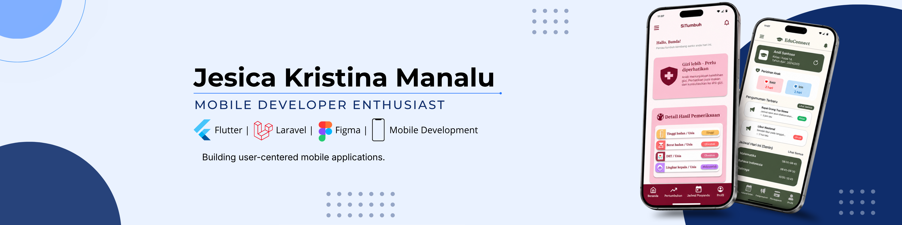

---

## ABOUT ME

- Informatics Student focused on Web & Mobile Development  
- Tech: Laravel, Flutter, MySQL  
- Passionate about building impactful applications  
- Always learning modern technologies

---

## TECH STACK

---

## FEATURED PROJECTS

</table>
  <tr>
    <td width="50%" valign="top">
      <h3>TICS ID</h3>
      
Web-based cinema ticket booking and reservation application designed to simplify movie ticket ordering and scheduling.

      <h4>Tech Stack</h4>
      
<code>Laravel</code> <code>MySQL</code> <code>Tailwind CSS</code>

     </td>
    <td width="50%" valign="top">
      <h3>Forcue</h3>
      
Web-based billiard table booking and reservation application with a modern and user-friendly interface.

      <h4>Tech Stack</h4>
      
<code>Laravel</code> <code>MySQL</code> <code>Tailwind CSS</code>

     </td>
   </tr>
  <tr>
    <td width="50%" valign="top">
      <h3>EduConnect</h3>
      
Web and mobile-based parent-student information system application that connects parents and teachers to support communication and student monitoring.

      
<em>The mobile application is designed for parents, while teachers and administrators use the web platform.</em>

      <h4>Tech Stack</h4>
      
<code>Laravel</code> <code>MySQL</code> <code>Flutter</code> <code>Dart</code>

     </td>
    <td width="50%" valign="top">
      <h3>SiTumbuh</h3>
      
Early stunting risk detection and child growth monitoring application using WHO Standard Z-Score calculations for growth assessment.

      <h4>Tech Stack</h4>
      
<code>Flutter</code> <code>Dart</code> <code>Laravel</code> <code>MySQL</code> <code>WHO Z-Score</code>

     </td>
   </tr>
</tr>

---

## GITHUB STATISTICS

---

## CONTRIBUTION ACTIVITY

---

## CONNECT WITH ME

